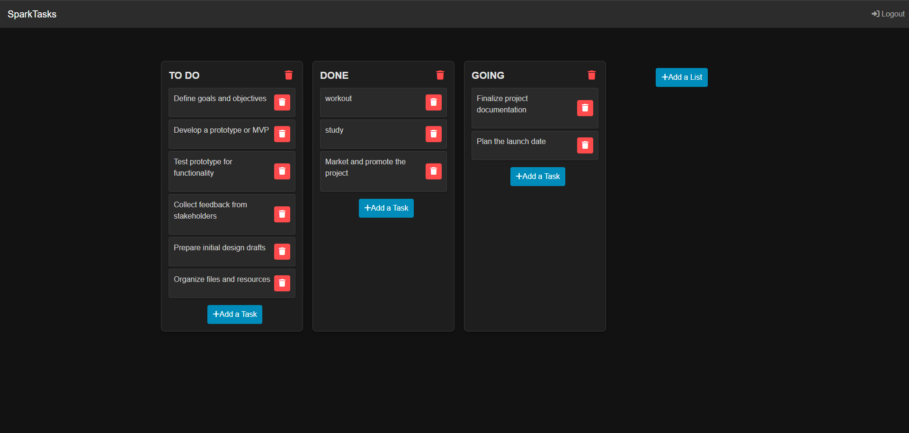
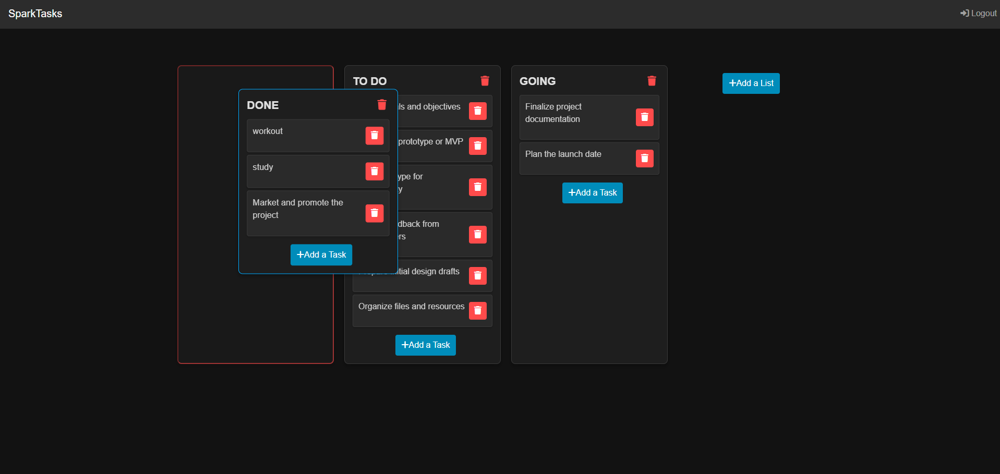
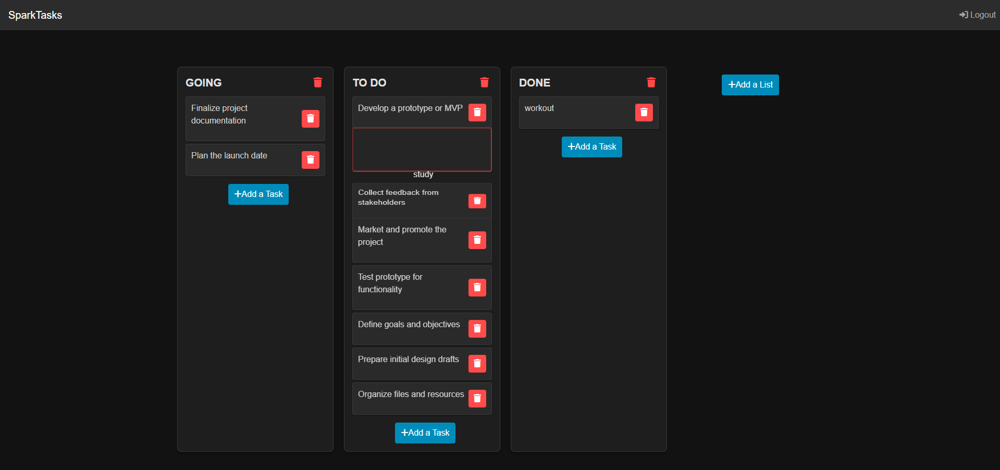

# SparkTasks

# Descripción

"SparkTasks" es una aplicación la cual permite a los usuarios crear y gestionar listas de tareas de manera sencilla y organizada. Cada lista actúa como un espacio donde los usuarios pueden agregar múltiples tareas relacionadas.

# Tecnologías utilizadas:

- **Frontend:** Javascript, React, CSS
- **Backend:** Flask, SQLAlchemy, Python
- **Base de Datos:** PostgreSQL (SQLAlchemy)

# Características:

- **Creación de listas:** Los usuarios pueden crear, agregar, editar y reordenar una lista para un proyecto o categoría específica.
- **Gestión de tareas:** Dentro de cada lista, pueden agregar, editar, reordenar y eliminar tareas según lo necesiten.
- **Interfaz intuitiva:** Permite la interacción rápida, con botones de fácil acceso para añadir o modificar elementos.

# Drag and Drop

